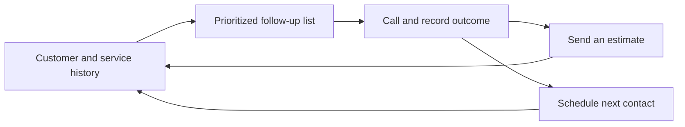

# CallSheet

### A bilingual CRM for small service contractors

CallSheet helps a contractor decide whom to call, record what happened, send an estimate and schedule the next follow-up. It brings those steps into one customer history instead of leaving them across a phone, a spreadsheet and a calendar.

**Public engineering case study. The application implementation is private; this repository contains documentation, not runnable product source.**

Co-built by **Jonah Elliott and Evan Pursley**. CallSheet served **two paying customers**, as reported by cofounder Jonah Elliott. This is a historical product outcome, not a claim about current subscribers or revenue.

## The product loop

The implementation includes English/Spanish localization, customer notes, CSV import, team roles, subscription billing, Google Calendar integration and SMS estimates. Its priority ranking is a **deterministic business heuristic** over value, urgency, risk and opportunity. It is not a learned ranking model.

## Engineering worth inspecting

- **Business workflows across providers.** React and FastAPI connect customer activity with PostgreSQL, Clerk, Stripe, Twilio and Google Calendar.
- **Explicit estimate states.** Creating an estimate, submitting an SMS, viewing it and accepting it are distinct events. A provider accepting a message does not prove handset delivery.
- **Account-scoped operations.** Authenticated identities resolve to a business account; repositories and services carry that scope into customer operations.
- **A service layer around integrations.** Business operations sit behind HTTP handlers and use repository/provider interfaces, making provider failures and test substitutes explicit.

## Read the case study

| Document | What it explains |
|---|---|
| [Architecture](docs/architecture.md) | Components, data ownership and integration boundaries |
| [Workflows](docs/workflows.md) | Synthetic follow-up example and estimate state diagram |
| [Engineering decisions](docs/engineering-decisions.md) | Decisions visible in the implementation and their tradeoffs |
| [Validation and status](docs/validation.md) | Evidence, test coverage topics and limits of this public artifact |

Checked against an implementation snapshot on **September 21, 2026**. Examples are synthetic. The private test suite was not rerun to prepare these pages, and no current production session was exercised.

[Jonah's GitHub](https://github.com/JonahFSD) · [Cadmus](https://github.com/JonahFSD/Cadmus-Public) · [Kronos](https://github.com/JonahFSD/Kronos-Public) · [Arlis](https://github.com/JonahFSD/Arlis-Public)
