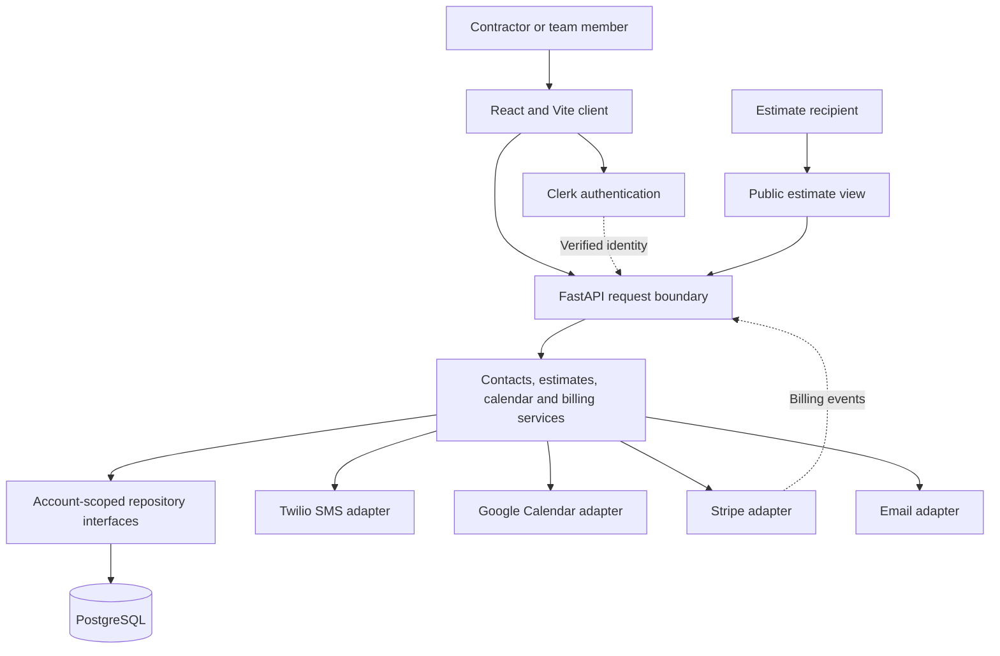
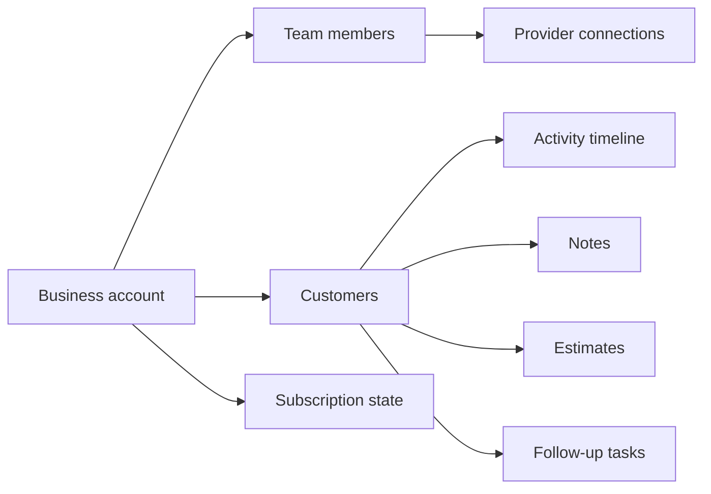

# System architecture

[Overview](../README.md) · [Workflows](workflows.md) · [Decisions](engineering-decisions.md) · [Validation](validation.md)

CallSheet is a multi-tenant web application. A business account owns its customer relationships, activity and estimates; team members act within that account. The frontend presents the daily work, while the backend resolves identity, applies business rules and coordinates persistence and providers.

## Components and boundaries

This is a logical architecture, not a deployment map. It omits credentials, hostnames and operational configuration.

| Layer | Responsibility | Technology |
|---|---|---|
| Client | Daily list, customer workflow, estimates, calendar and translated interface | React 18, Vite, i18next |
| HTTP boundary | Parse requests, resolve identity, invoke use cases and map responses | FastAPI, Python |
| Services | Coordinate customer, estimate, messaging, calendar and billing operations | Python services with injected dependencies |
| Persistence | Store account data and expose repository operations | SQLAlchemy, PostgreSQL |
| Providers | Translate domain requests into external service operations | Clerk, Stripe, Twilio, Google, email provider |

The service layer primarily uses repository and provider ports. This is an organizing boundary rather than a claim that every integration is perfectly abstracted: the estimate service, for example, directly takes the concrete SMS adapter. Tests and future changes should follow the actual dependency graph.

## Data ownership

This summarizes ownership, not the production schema. A customer's timeline provides context for the next call, and scheduled tasks turn a previous conversation into future work.

Authentication establishes a user identity; business operations use the associated account when locating records. Role checks address a separate question: what may this team member do within that account? These mechanisms and related tests do not constitute an independent security certification.

An estimate recipient follows a separate path. A purpose-specific estimate link grants access to that estimate workflow without requiring the customer to join the contractor's team. It is distinct from authenticated staff access to the CRM.

## Provider state and local state

Customer records, external calendar events, SMS submissions and payment-provider events have different authorities. A local write does not establish that an external effect occurred. The estimate service persists a draft before attempting SMS submission and records the provider result separately.

Google Calendar functionality and estimate acceptance also remain separate. Calendar integration exists, but the inspected acceptance path does not create a calendar event automatically. The [workflow notes](workflows.md) preserve that distinction.
