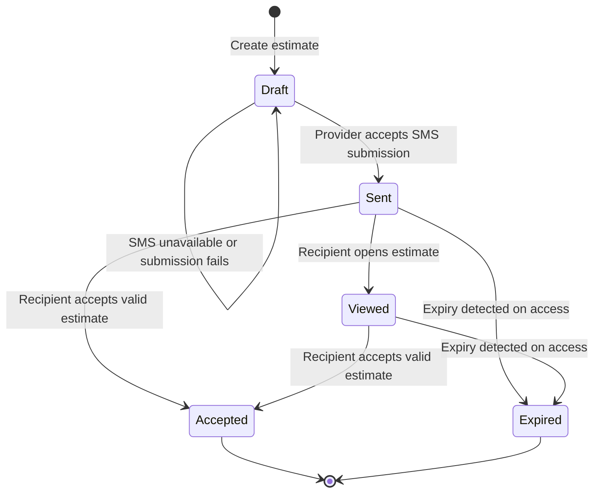
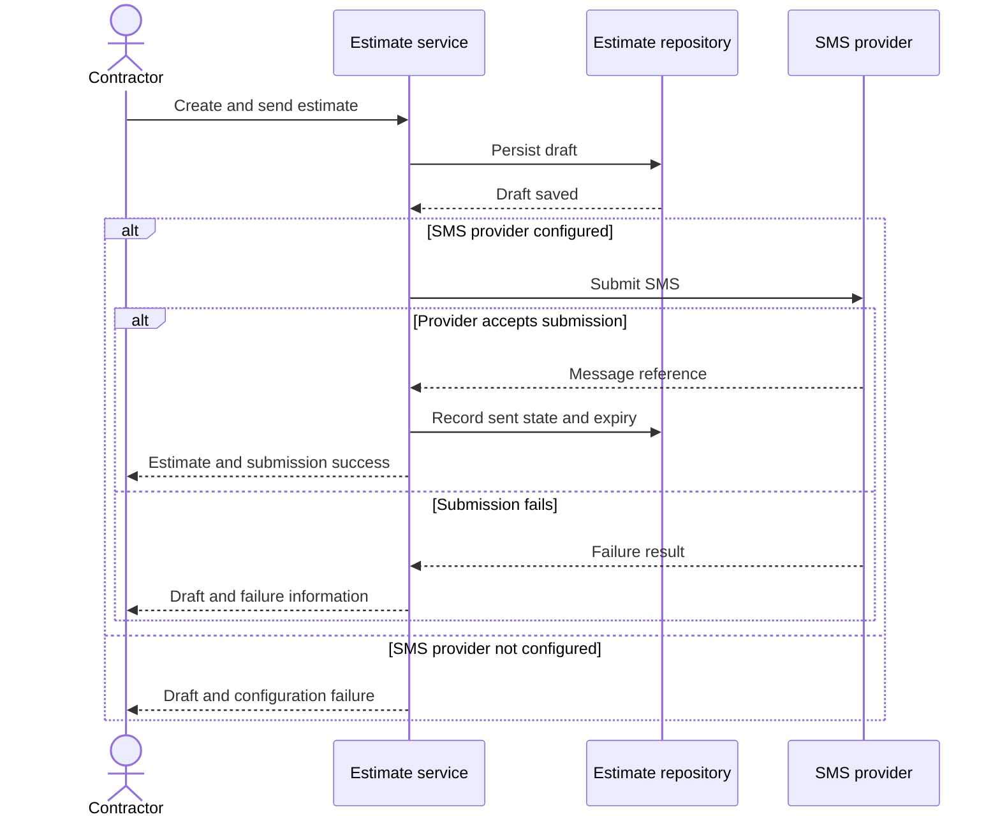

# Workflows

[Overview](../README.md) · [Architecture](architecture.md) · [Decisions](engineering-decisions.md) · [Validation](validation.md)

## A contractor's morning

**Synthetic example:** a maintenance business opens CallSheet. One customer has an overdue service interval, another recently viewed an estimate, and a third has a follow-up scheduled. These are invented situations, not customer records or a measured production session.

1. The daily view draws on service and contact history to rank follow-up candidates.
2. The contractor inspects a customer and starts a call.
3. The outcome is recorded, preserving context for the next interaction.
4. The contractor can send an estimate or schedule another contact.
5. The resulting activity becomes input to future work.

The ranking organizes attention; it does not make the customer decision for the contractor.

## Prioritization

| Component | Examples of inputs | Interpretation |
|---|---|---|
| Value | Service history, invoice value, contract and payment context | Existing commercial relationship |
| Urgency | Service interval, overdue ratio, recent outcomes | Timing of the next action |
| Risk | Missed contacts, irregular gaps, estimate/payment context | Reasons to revisit the relationship |
| Opportunity | Seasonal context and estimate engagement | A potentially useful time to reach out |

The total is capped at 100. The implementation includes adjustments beyond the original component descriptions, so these pages do not present old nominal component ranges as strict invariants. A high score is an ordering heuristic, not a churn probability, forecast or measured likelihood of conversion.

## Estimate lifecycle

`Sent` records successful provider submission. In the inspected path, the accompanying SMS status begins as queued; it is not proof of handset delivery or reading.

The estimate is created as a draft before the provider call. If SMS cannot be submitted, the service returns the persisted draft and a failure result. On success, it records submission details and sets an expiry. Viewing can mark a sent estimate viewed; acceptance permits either sent or viewed estimates, provided they have not expired. Already accepted and expired estimates are not accepted again by this service path.

This describes service ordering, not exactly-once SMS delivery across every interruption. External effects and database updates are separate operations.

## Calendar and billing

The calendar service handles connection, event operations and contact-import workflows through provider interfaces. Connecting a calendar does not mean every CRM action creates an event: automatic event creation on estimate acceptance remains outside the inspected completed path.

Subscription billing has its own lifecycle: checkout, portal access and provider events affect local subscription state. That state supports product access decisions. Implemented billing integration and the two historical paying customers are separate kinds of evidence.
